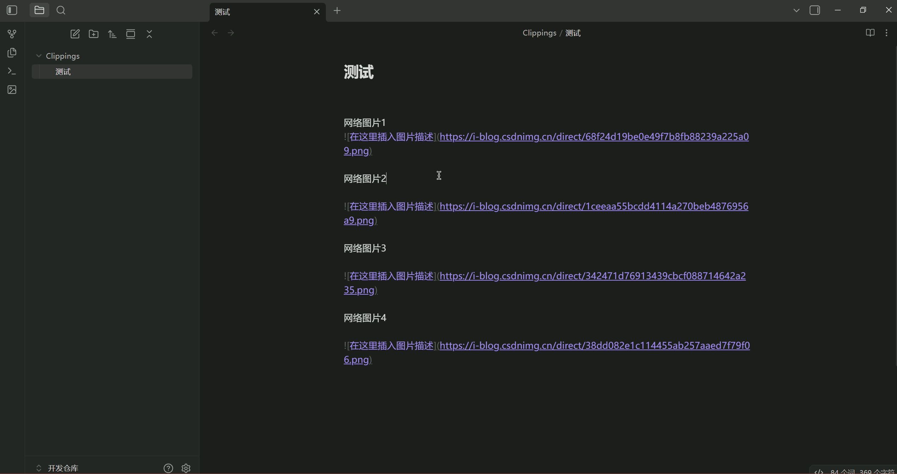

# Auto Download Image

[中文文档](./README_CN.md)

An Obsidian plugin that automatically detects network images in the current note, downloads them to the local directory with custom naming, and replaces them with local relative paths.



⚠️ Disclaimer: 80% of the code in this project was generated by AI. Although it has undergone multiple rounds of testing and review, there may still be unknown bugs and compatibility issues with other plugins. Therefore, please backup your note library before using this plugin. By using this plugin, you voluntarily accept all risks.

⚠️ This project does not accept any PRs. Future updates may not be considered. If you have other requirements, please download the source code and develop it yourself. The [AGENTS](./AGENTS.md) file records the project structure and descriptions of classes and functions in the project files.

## ✨ Features

- 🔍 **Automatic Detection**: Automatically recognizes network image links in Markdown format `` and ``
- 📥 **Batch Download**: Download all network images in the current note to local with one click, naming them in the format "note name + date time"
- 📁 **Flexible Save Locations**:
  - Save in a folder in the same directory as the note
  - Save in a specified folder in the vault root directory
  - Consistent with Obsidian attachment folder
- 🔗 **Path Type Selection**: Supports absolute paths and relative paths
- ⌚ **Download Interval**: To prevent excessive requests, the image download interval has been set to 1.5 seconds
- ⚠️ **Limitation**: Currently only supports downloading images from one note (the currently open note) at a time, and does not support multiple notes

## 📦 Installation

1. Visit the [Releases page](https://github.com/fzy-yy/auto-download-image/releases)
2. Download the latest version of `main.js`, `manifest.json`, and `styles.css` files
3. Copy the files to your Obsidian plugin directory:
   - Windows: `C:\Users\YourUsername\.obsidian\plugins\auto-download-image\`
   - macOS: `~/.obsidian/plugins/auto-download-image/`
   - Linux: `~/.obsidian/plugins/auto-download-image/`
4. Enable the plugin in Obsidian settings

## 🚀 Usage

### Basic Usage

1. **Through Ribbon Icon**
   - Click the image icon in the left ribbon
   - View the list of images to be processed in the confirmation dialog
   - Click "Confirm" to start downloading

2. **Through Command Palette**
   - Press `Ctrl/Cmd + P` to open the command palette
   - Type "Download and replace network images"
   - Select the command and execute

### Usage Example

Insert network images in your note:

```markdown

```

After clicking download, the image will be downloaded locally and replaced with:

```markdown

```

## ⚙️ Configuration Options

Find the "Auto download image" tab in Obsidian settings to configure:

### 1. Image Save Location

Choose the location to save images:

- **Note Folder**: Save in a folder in the same directory as the note (customizable subfolder name)
- **Vault Folder**: Save in a specified folder in the vault root directory (customizable folder name)
- **Obsidian Attachment Folder**: Consistent with Obsidian attachment settings

### 2. Image Link Path Type

Choose the path type for image links:

- **Absolute Path**: Complete path from the vault root directory (e.g., `folder/image.png`)
- **Relative Path**: Relative path from the note location (e.g., `../folder/image.png`), convenient for vault migration

### 3. Image Naming Format

Customize the naming format of images, only the following placeholders are supported:

- `{notename}` - Note name (without extension)
- `{date}` - Date (YYYY-MM-DD format)
- `{time}` - Time (HH-MM-SS format)

## ⚠️ Notes

- This plugin only supports the desktop version of Obsidian
- Downloading large images may take a long time
- Some websites may have anti-crawling mechanisms, and downloads may fail
- Please ensure sufficient network bandwidth and storage space

## 📚 FAQ

### Q: What should I do if the download fails?

A: Check the following:

1. Whether the network connection is normal
2. Whether the image link is accessible
3. Whether it is blocked by the website's anti-crawling mechanism
4. Check the console log for detailed error information

### Q: How do I change the save location?

A: Find the "Auto download image" tab in Obsidian settings and modify the "Image save location" setting.

### Q: What image formats are supported?

A: Supports common image formats such as PNG, JPG, JPEG, GIF, WebP, BMP, SVG, etc.

### Q: How do I batch process multiple notes?

A: Currently, you need to open notes one by one for processing. Future versions may support batch processing functionality.
